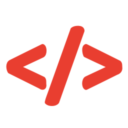
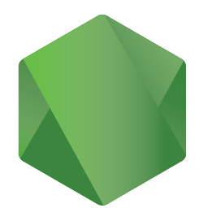
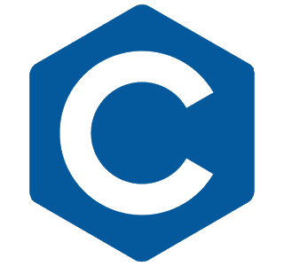

 

 

### Hi there 👋

Olá, meu nome é Pedro, sou Desenvovlvedor Back-end Java!

____

### ⚡ Tecnologias

Técnologias mais usadas:

Backend: 

Frontend:

Database:

Cloud:

Tools:
<!--  -->

IDEs:

### Conhecimentos Básicos

Git - Versionamento de Código 
  

Github - Repositório 
  

Linux - Instalação e configuração 
  

JSON - Comunicação com API's 
  

XML - Dependências em Java SpringBoot 
  

HTML - Criação de Páginas para Web Estáticas, incluindas no Github Pages 
  

CSS - Estilização das Páginas para Web 
  

Javascript - Lógica de programação para Web 
  

Angular 
  

NodeJs e NPM - Programação
  

NestJS - API Rest 
  

Python - Estudos de Lógica de Programação
  

Oracle SQL - Relatórios em SQL
  

### Conhecimentos Intermediários

Algoritmos e Estrutura de Dados com C 
  

Java - Programação Orientada a Objetos, API's, APP's Desktop com Swing e Conexão com Banco através do JPA 
  

Typescript - Programação Orientada a Objetos para Web 
  

PostgreSQL - Projetos com Bancos pessoais
  

SQL Server - Projetos da Faculdade
  
